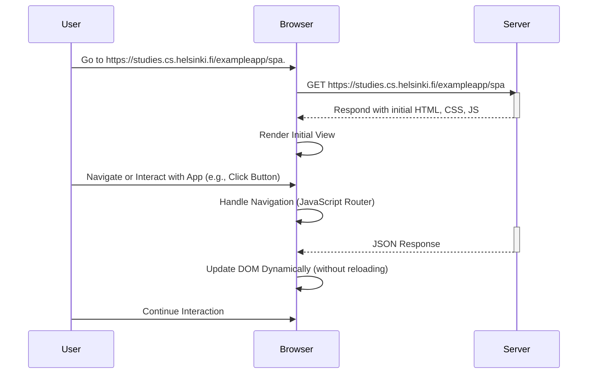

```mermaid
sequenceDiagram
    participant User
    participant Browser
    participant Server

    User->>Browser: Go to https://studies.cs.helsinki.fi/exampleapp/spa.
    Browser->>Server: GET https://studies.cs.helsinki.fi/exampleapp/spa
    activate Server
    Server-->>Browser: Respond with initial HTML, CSS, JS
    deactivate Server
    Browser->>Browser: Render Initial View
    User->>Browser: Navigate or Interact with App (e.g., Click Button)
    Browser->>Browser: Handle Navigation (JavaScript Router)
    activate Server
    Server-->>Browser: JSON Response
    deactivate Server
    Browser->>Browser: Update DOM Dynamically (without reloading)
    User->>Browser: Continue Interaction
```